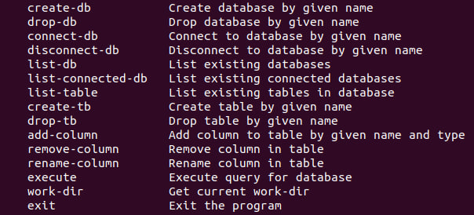
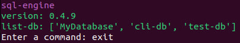

# sql-engine
## Branch: Pre-Production


### Status: Prototype for Pre-Production

**Start Date:** October 11, 2023  
**End Date:** October 24, 2023

### Description

The SQL Engine Library offers a comprehensive set of tools for database management, SQL query execution, and data manipulation.

The prototype of the engine consists of three main components:

1. **Database Creation and Management Library**: Provides functionality for creating, utilizing, and managing databases.
2. **SQL Parsing and Query Execution Library**: Enables parsing and executing SQL queries.
3. **Command Line Interface (CLI)**: Allows users to test the functionality of the project through a command-line interface.

### Goal

The primary goal of this project is to build a substantial portfolio and validate my programming knowledge and skills.

### Table of Contents

1. [Installation](#installation)
2. [Usage](#usage)
3. [Testing](#testing)
4. [License](#license)

---
## Installation

### Tested Operating Systems

- [ ] Ubuntu
- [ ] Windows 10

### Dependencies

The project has been implemented in Python 3, and it requires the following dependencies:
- Git (for cloning the project)
- Python 3 (for running and testing the project)

### Installation

To get started, clone the project repository and switch to the 'preproduction' branch.
```sh
git clone https://github.com/VahagnGishyan/sql-engine.git
cd ./sql-engine
git checkout preproduction
```

---
## Usage

### List of Commands

Here is the list of supported commands that you can use in the CLI:



> **_NOTE:_**  You can view this list using the `-h` option in the CLI.

### Running the CLI

To run the CLI application, execute the following shell command:

```shell
python3 run-cli.py
```

The CLI will display the version and wait for your commands.


> **_NOTE:_**  The CLI parser uses argparse, so the library will exit if the user input doesn't match the expected format.

### First Operations

When you run the CLI for the first time, you'll likely see an empty list of existing databases. Here are some initial operations to perform:

1. Create a database: Use the following template `create-db your-db-name`.
2. Connect to a database: Run `connect-db your-db-name`.
3. Create a table: Use `create-tb your-db-name tb-name name text completed boolean`.
4. Query the table: You can check the table with a query like this `execute your-db-name select name completed from tb-name`.
5. Manage table data: The prototype supports these SQL operations:
    - `select <column-list> from <table-name> where <condition-list>`
    - `insert into <table-name> (<column-list>) values (<value-list>)`
    - `update <table-name> set column1 = value1, column2 = value2, ... where <condition-list>`
    - `delete from table-name where <condition-list>`

> **_NOTE:_**  Sometimes the lexer may have trouble parsing identifiers with snake case.

### Saved Files

If the CLI isn't sufficient to explore the library's functionality, you can examine the file hierarchy. To do so, run the `work-dir` command and navigate to the specified path. There, you will find the database manager and your database files. You can check the values by inspecting the table data in the files.

---
## Testing

In this project, comprehensive tests have been implemented for both the database management and SQL parsing libraries. These tests are designed to thoroughly assess the functionality of the libraries.

Python 3's `unittest` framework has been utilized for running these tests. To execute the tests, simply run the following command in your terminal:

```sh
python3 -m unittest discover
```

---
## License

This project is licensed under the [MIT License](LICENSE.md).
